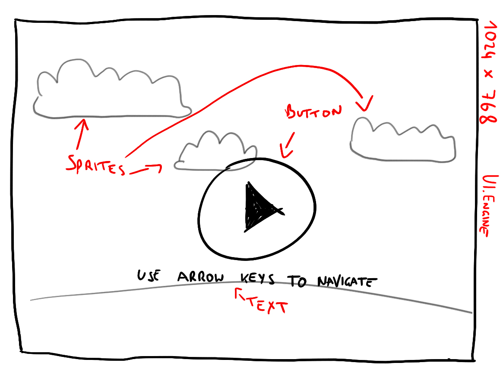
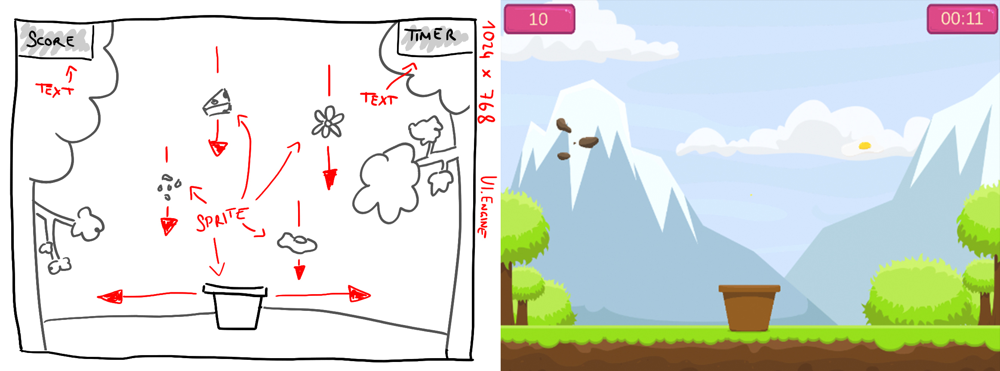
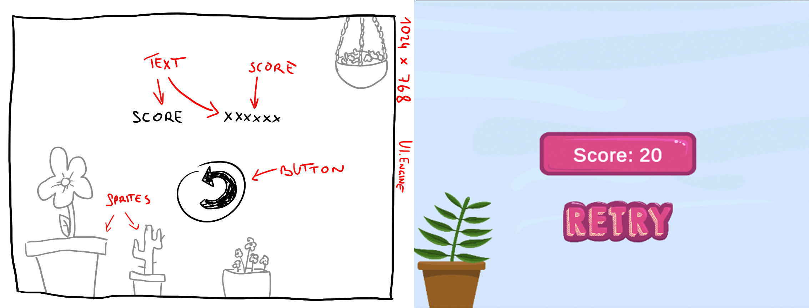

# MiniGame1-cpratter

**Progress:** 65%

### Development Platform
- OS: MacOS 10.14.3
- Unity Version: 2018.2.14f1
- Visual Studio Code Version: 1.33.0
-Scripting Runtime Version: .NET 3.5 Equivalen
-API Compatibility Level: .NET 2.0 Subs

### Target Platform
- WebGL

### Description
Der Spieler bewegt mit den Pfeiltasten der Tastatur einen Blumentopf mit dem er gute Items (Samen, Blumen) aufsammeln muss. Diese geben jeweils 20 Punkte und wenn man ein schlechtes Item (Käse, Spiegelei) aufsammelt, gibt es 10 Minuspunkte. Man hat 60 Sekunden Zeit und am Ende kann man seinen Punktestand sehen.

### Control
Use arrow keys to move.

### Resources
- TextMeshPro (TMP)
- Illustrations: Celina Pratter

### Mockups
- Intro Screen

  

- Main Screen

  

- End Screen

  

